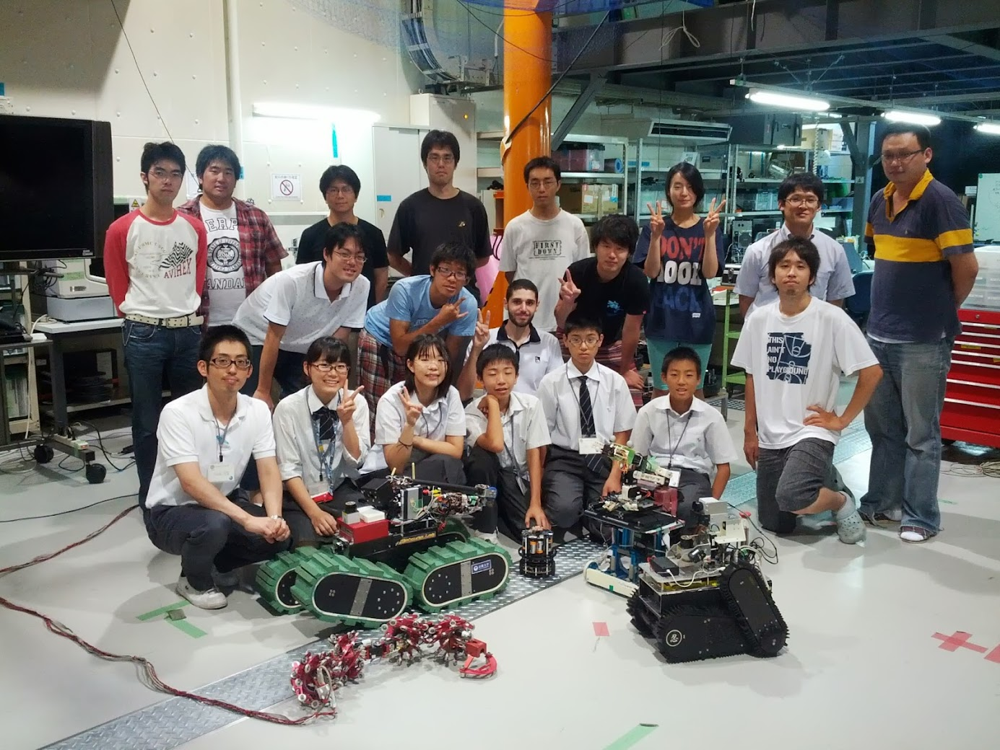
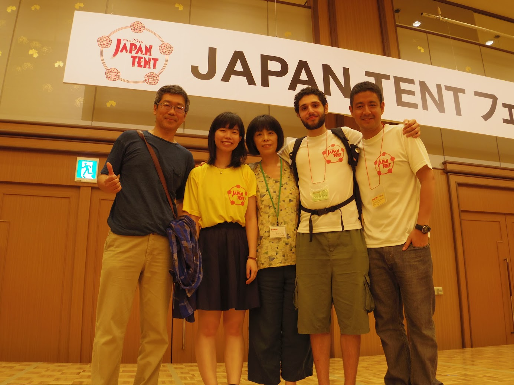
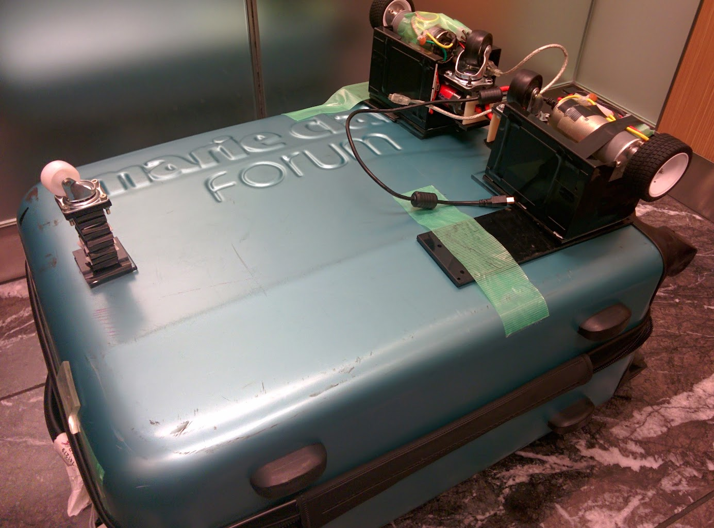

# Kyoto University
2013 &ndash; 2017

??? summary

    - Was a member of the Mechatronics Laboratory from 2013 to 2017, graduated with a Master of Engineering degree from the Department of Mechanical Engineering.
    - Worked on many projects, primarily in the field of human-robot interaction, including the development of a teleoperation system for drones and gestural control of robots.
    - Participated in the 2016 Japan Tent program, a cultural exchange program by Ishikawa Prefecture.
    - Completed several course projects in areas including design and manufacturing engineering, dynamic system control theory, and engineering ethics.

{: style="width:400px", align=right}
I was a member of the [Mechatronics Laboratory](http://www.mechatronics.me.kyoto-u.ac.jp/index.php?ml_lang=en) at Kyoto University from 2013 to 2017.
I joined as a research student in 2013, and enrolled in the Masters program starting in April 2014.
I graduated in March 2017 with a Master of Engineering degree from the Department of Mechanical Engineering.

While at Kyoto University, I worked on [many projects](#highlighted-projects).
My research topics were primarily on the topic of [human-robot interaction](https://en.wikipedia.org/wiki/Human%E2%80%93robot_interaction).
I started out working on the [gestural control of robots](../projects/myo.md),
and switched to [teleoperation of drones](../projects/spirit.md) in my second year.

At Kyoto University, I also [tutored other students](../teaching.md) in Python and software development best practices,
including testing and version control.
I also participated in the [RoboCup Japan Open Rescue League](../projects/yozakura.md) multiple times in the teleoperated division.

Apart from academics, I used the opportunity to explore Japan and its culture.
For example, I [climbed Mount Fuji](../../assets/images/fuji.jpg),
hiked and biked through mountains and valleys, took part in the [Kyoto Association of Host Families (KAHF)](../../assets/images/KAHF.jpg) program,
obtained a scholarship from Kiyomizudera Temple, and more.

{: style="width:400px", align=right}
I also participated in the 2016 edition of [Japan Tent](https://www.japantent.com/english.html)
(link not accessible from the EU), a program by Ishikawa Prefecture which allows foreign students from across Japan
to stay with two families in the region.
I was selected as a Japan Tent ambassador for the year thanks to my Japanese ability.

## Highlighted projects
### Spirit
As part of a master's thesis at Kyoto University from 2015 to 2017,
I developed [SPIRIT (Subimposed Past Image Records Implemented for Teleoperation)](../projects/spirit.md).

This system aimed to make teleoperation of drones more reliable in environments such as collapsed structures,
where connectivity can be compromised.
The system layered past and present drone images to assist in navigation,
even with degraded signals or low transmission rates.

Notable results were yielded from the user studies conducted, indicating the system's effectiveness.
Moreover, SPIRIT showcased a flexible, well-documented code structure,
allowing for modifications and enhancements via its evaluation functions.

### Yozakura
During 2014 and 2015, [Yozakura](../projects/yozakura.md), a teleoperated rescue robot, was developed as part of the
Kyoto University Mechatronics Lab's SHINOBI team.

Yozakura was equipped with star-shaped wheels, flippers, a robotic arm, and various sensors,
aimed at competing in the 2015 RoboCup Japan Open Rescue League.

I was the software development lead for Yozakura, and focused on creating a client-server system for controlling the robot
and developing drivers for its various components.
The software was also designed with robustness and adaptability in mind,
logging critical data, providing useful error messages, and being capable of self-correction when possible.

### Gestural control of robots
Between 2014 and 2015 at Kyoto University, I developed a [gesture-based robotic control system](../projects/myo.md),
leveraging the Myo armband from Thalmic labs.
The main focus of this project was to establish an intuitive, ergonomic method of controlling robots,
with the main challenge being the determination of the most effective gesture mappings.

Despite its eventual discontinuation before reaching a fully functional version,
the project succeeded in laying the groundwork for a system that abstracted away from the interface,
potentially enabling control via computer vision or other input sources.

### Course projects
In the _Design and Manufacturing Engineering_ course, I wrote a routing algorithm for a CNC.

For the _Dynamic System Control Theory_ course,
I modeled the dynamics of a small and large ship with and without rudder control,
and wrote a Kalman filter to reduce perturbations.
I also used dynamic programming to solve a waste disposal problem.

For the _Engineering Ethics and Management of Technology_ course,
we analyzed the cause of an engineering disaster,
and submitted proposals for a safer system.
We also developed a new product and submitted a (mock) pitch in order to secure funding.

### Miscellaneous
{: align=right width=200px }
At the 2015 OpenHackDay hackathon, which was held over two days at the Yahoo Japan headquarters in Tokyo,
my team and I made a suitcase which follows its owner over various terrains.

## Course list
### Robotics and Controls
- Robotics
- Dynamic system control theory

### Physics and Thermodynamics
- Dynamics of atomic systems
- Thermal science and engineering
- Thermophysics for thermal engineering
- High energy radiation effects in solids

### Biomedical engineering
- Biomechanics
- Introduction to biomedical engineering

### Technical engineering and Design
- Design and manufacturing engineering
- High precision engineering
- Applied numerical methods
- Finite element methods

### Engineering ethics and Management
- Engineering ethics and management of technology
