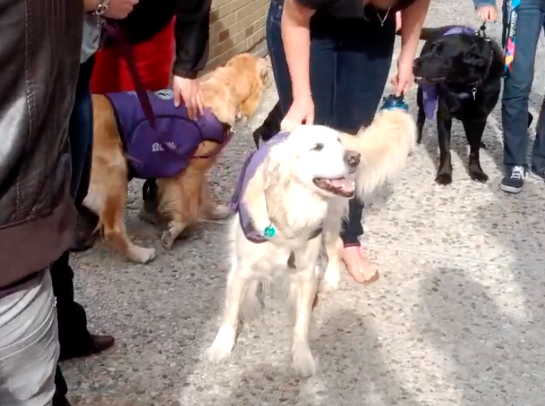

# University of Waterloo
I studied at the University of Waterloo from 2008 to 2013,
and graduated with a Bachelor of Applied Science in Honours Mechatronics Engineering.

??? summary

    - Completed Bachelor of Applied Science in Honours Mechatronics Engineering from 2008 to 2013.
    - Studied a combination of mechanical, electrical, and software engineering with a focus on practical application.
    - Completed six co-operative education internships in three countries over a total of two years.
    - Participated heavily in extracurricular activities, including several clubs and initiatives.
    - Completed numerous projects across a variety of disciplines including mechatronics, mechanical engineering, electrical engineering,
      computer engineering, controls, bioengineering, mathematics, and entrepreneurship.

The program is a combination of mechanical, electrical, and software engineering,
and was heavily practical, with [many hands-on projects](#projects) for students to apply concepts learned in the classroom.
I also completed [six co-operative education (co-op) internships](../work_experience/coop.md)
in three countries over a total of two years.
Each co-op is normally a four-month-long remunerated full-time position,
which allows a student to experience various facets of engineering.

## Extracurricular activities
I participated heavily in extracurricular activities.
For example, I was an active member of the [Konnichiwa Japan club](https://www.uwkonja.com/about.html) between 2010 and 2013,
including one term as secretary.
I was involved in recruiting new members, and handled internal and external club communications.

In 2010, I was also the secretary of the [Club for Undergraduate Bioengineers (CUBE)](http://cube.uwaterloo.ca/index.php),
and helped organize the [4th International Symposium on Health Technology](http://cube.uwaterloo.ca/Symposium%202010%20web%20site/symp%202010.htm).
That included finding speakers, inviting them to come, following up with people who did not reply or submit papers,
and arranging accommodation for the speakers coming in from outside of Waterloo.

In 2012, I directed the University of Waterloo Engineering Society (EngSoc) mental health directorship.
As director, I introduced a successful initiative to bring service animals on campus during exams to help reduce student stress.
This was eventually emulated beyond the faculty of engineering.

Also in 2012, I co-founded the [Engineering Student Ambassador program](https://uwaterloo.ca/engineering-student-ambassadors/),
which encourages current engineering students to help give prospective students a personal and informative connection to the faculty of engineering.
The program is still active.

In 2012 and 2013, I was shadowed by two international exchange students as part of the [Waterloo Engineering Shadow program](https://uwaterloo.ca/engineering-student-ambassadors/shadow-program)
(now part of the Student Ambassador program), and helped them integrate into Canada and the university.
I also taught beginner and intermediate Japanese courses as a volunteer
with the [University of Waterloo Culture and Language Exchange Club (UWCLEC)](https://uwclec.webs.com/).

## Highlighted projects
I had five or six courses per academic term, for 42 courses total. Most of these courses had at least one project.
A few of them are below, broadly arranged by theme. For more details, please see the [dedicated project page](../projects/undergrad.md).

### [Mechatronics](../projects/undergrad.md#mechatronics)
- Constructed a line-following robot with LEGO Mindstorms.
- Built a line-following robot with analog sensors, designing the circuits with opamps, populating the PCBs ourselves, and programming the microcontroller.
- Developed an autonomous catamaran capable of traversing the perimeter of a pool, using Arduino for control and sonar sensors for feedback.
- Analyzed robots using DH Parameters, controlled some robots with VHDL, and implemented PLC code for an assembly line with three cells.
- Completed a final year project to design a portable water purification and transport system on a bicycle trailer,
  generating power through the motion of the trailer.

### [Mechanical Engineering](../projects/undergrad.md#mechanical-engineering)
- Constructed a small bridge operating under budget constraints.
- Constructed a crane boom truss from balsa wood aiming for maximum weight capacity.
- Simulated and analyzed a dump truck mechanism in Adams View to optimize physical connections.

### [Electrical Engineering](../projects/undergrad.md#electrical-engineering)
- Used Karnaugh maps and boolean algebra to simplify complicated states and design digital logic circuits, including a PLC traffic light controller.

### [Computer Engineering](../projects/undergrad.md#computer-engineering)
- Created an MP3 player with Altera DE2 FPGA, implementing features such as speed and direction control, song selection, and wav file reading.
- Developed a real-time operating system in C for a course on Computer Structures and Real-Time Systems.

### [Controls](../projects/undergrad.md#controls)
- Conducted position control of a flexible drive using Matlab and Simulink in an Automatic Control Systems course.
- Controlled the position of a ball on a ramp by inclining the beam using a DC motor, 
  calibrating the system and implementing compensators and saturators.
- Controlled hydraulic and pneumatic circuits to manage machines in response to various user or environment inputs.
- Designed and constructed a mechanical-electrical device to observe dynamic system behavior as it transitions between domains,
  using a bond graph for modeling and Matlab for simulation.

### [Bioengineering](../projects/undergrad.md#bioengineering)
- Captured, amplified, and processed myoelectric signals to control a robotic arm in the Human Signal Processing course.

### [Mathematics](../projects/undergrad.md#mathematics)
- Worked on process control, regression models, and factorial experiment design for a Statistics course.
- Simulated spring-mass and spring-mass-damper systems for an ODE course.
- Analyzed vehicle suspension systems using implemented numerical methods in a Numerical Methods course.
- Calculated the usable volume of a tank intersected by other pipes using Matlab and Maple for an Advanced Calculus project.

### [Entrepreneurship](../projects/undergrad.md#entrepreneurship)
- Developed a new business idea from market research to proposal formation,
  then pitched it to "investors" in the Technical Entrepreneurship course.

## Partial course list
### Mechatronics
- Actuators and power electronics
- Mechatronic system integration
- Mechatronics engineering
- Mechatronics engineering design workshop
- Mechatronics engineering final year project
- Sensors and instrumentation

### Control Systems
- Automatic control systems
- Fluid power control systems
- Linear systems and signals
- Systems models

### Electrical and Computer Engineering
- Circuits
- Digital computation
- Digital control applications
- Introduction to computer structures and real-time systems
- Introduction to microprocessors and digital logic
- Microprocessor systems and interfacing

### Mechanical Engineering and Design
- Dynamics
- Electromechanical machine design
- Kinematics and dynamics of machines
- Mechanics of deformable solids
- Statics

### Mathematics, Numerical Analysis, and Statistics
- Advanced calculus
- Experimental measurement and statistical analysis
- Numerical methods
- Ordinary differential equations
- Partial differential equations

### Biomedical engineering
- Biological and human systems
- Human signal processing

### Thermodynamics and Fluid Mechanics
- Fluid mechanics
- Introduction to thermodynamics and heat transfer

### Engineering Economics and Entrepreneurship
- Engineering economics
- Organisational design and technology
- Technical entrepreneurship
