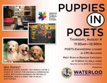

# Universiteit van Waterloo
2008 – 2013

??? summary "Overzicht"

    - Bachelor of Applied Science behaald in Mechatronica Engineering met onderscheiding van 2008 tot 2013.
    - Studie van een combinatie van mechanica, elektriciteit en software engineering gericht op praktische toepassing.
    - Zes coöperatieve stages uitgevoerd in drie landen over een totale periode van twee jaar.
    - Actief deelgenomen aan buitenschoolse activiteiten, waaronder verschillende clubs en initiatieven.
    - Veel projecten uitgevoerd in verschillende disciplines waaronder mechatronica, mechanica, elektriciteit,
      informatica, controles, bio-engineering, wiskunde en ondernemerschap.

Ik heb gestudeerd aan de Universiteit van Waterloo van 2008 tot 2013,
en behaalde een Bachelor of Applied Science in Mechatronica Engineering met onderscheiding.

Het programma is een combinatie van mechanica, elektriciteit en software engineering,
en was sterk gericht op praktische toepassingen, met [veel hands-on projecten](#projecten) om studenten de geleerde concepten te laten toepassen.
Ik heb ook [zes coöperatieve stages](../work_experience/coop.md)
uitgevoerd in drie landen over een totale periode van twee jaar.
Elke stage is normaal gesproken een fulltime betaalde positie van vier maanden,
waardoor een student verschillende aspecten van engineering kan ontdekken.

## Buitenschoolse activiteiten
Ik heb actief deelgenomen aan buitenschoolse activiteiten.
Bijvoorbeeld, ik was een actief lid van de [Konnichiwa Japan club](https://www.uwkonja.com/about.html) tussen 2010 en 2013,
inclusief een termijn als secretaris.
Ik hielp bij het werven van nieuwe leden, en ik beheerde de interne en externe communicatie van de club.

In 2010 was ik ook de secretaris van de [Club for Undergraduate Bioengineers (CUBE)](http://cube.uwaterloo.ca/index.php),
en hielp ik bij de organisatie van het [4e International Symposium on Health Technology](http://cube.uwaterloo.ca/Symposium%202010%20web%20site/symp%202010.htm).
Dit omvatte het zoeken naar sprekers, hen uitnodigen om te komen, het opvolgen van mensen die niet reageerden of documenten indienden,
en het regelen van accommodatie voor sprekers die van buiten Waterloo kwamen.

In 2012 leidde ik de geestelijke gezondheidsdirectie van de University of Waterloo Engineering Society (EngSoc).
Als directeur introduceerde ik een succesvol initiatief om hulpdieren op de campus te brengen tijdens examens om de stress van studenten te verminderen.
Dit werd uiteindelijk nagevolgd buiten de faculteit van engineering.

Ook in 2012 co-oprichtte ik het [Engineering Student Ambassador program](https://uwaterloo.ca/engineering-student-ambassadors/),
dat huidige engineeringstudenten aanmoedigt om potentiële studenten een persoonlijke en informatieve link te bieden met de faculteit van engineering.
Het programma is nog steeds actief.

In 2012 en 2013 werd ik gevolgd door twee internationale uitwisselingsstudenten als onderdeel van het [Waterloo Engineering Shadow program](https://uwaterloo.ca/engineering-student-ambassadors/shadow-program)
(nu onderdeel van het Student Ambassador programma), en hielp ik hen te integreren in Canada en de universiteit.
Ik gaf ook vrijwillig beginner- en intermediate Japanse lessen
met de [University of Waterloo Culture and Language Exchange Club (UWCLEC)](https://uwclec.webs.com/).

## Uitgelichte projecten
Ik had vijf of zes cursussen per universitair semester, voor een totaal van 42 cursussen. De meeste van deze cursussen hadden minstens één project.
Enkele daarvan staan hieronder, grotendeels gerangschikt op thema. Voor meer details, zie de [speciale projectpagina](../projects/undergrad.md).

### [Mechatronica](../projects/undergrad.md#mechatronica)
- Bouw van een lijnvolgrobot met LEGO Mindstorms.
- Bouw van een lijnvolgrobot met analoge sensoren, ontwerp van schakelingen met operationele versterkers, bevolking van PCB's door onszelf, en programmering van de microcontroller.
- Ontwikkeling van een autonome catamaran die in staat is om het omtrek van een zwembad over te steken, met behulp van Arduino voor de besturing en sonarsensoren voor feedback.
- Analyse van robots met behulp van DH-parameters, besturing van bepaalde robots met VHDL, en implementatie van PLC-code voor een productielijn met drie cellen.
- Uitvoering van een eindproject om een draagbaar waterzuiverings- en transportsysteem te ontwerpen op een fietskar,
  met energieopwekking door de beweging van de kar.

### [Werktuigbouwkunde](../projects/undergrad.md#werktuigbouwkunde)
- Bouw van een kleine brug binnen budgetbeperkingen.
- Bouw van een kraanbalk uit balsahout gericht op maximale gewichtscapaciteit.
- Simulatie en analyse van een kiepmechanisme in Adams View om de fysieke verbindingen te optimaliseren.

### [Elektrotechniek](../projects/undergrad.md#elektrotechniek)
- Gebruik van Karnaugh-kaarten en Booleaanse algebra om gecompliceerde staten te vereenvoudigen en digitale logische circuits te ontwerpen, waaronder een PLC-verkeerslichtregelaar.

### [Informatica](../projects/undergrad.md#informatica)
- Maken van een MP3-speler met een Altera DE2 FPGA, met functies zoals snelheid en richting, nummerselectie en afspelen van wav-bestanden.
- Ontwikkelen van een realtime besturingssysteem in C voor een cursus over computerstructuren en realtime systemen.

### [Controles](../projects/undergrad.md#controles)
- Positiebesturing van een flexibele aandrijving met behulp van Matlab en Simulink in een cursus over automatische controlesystemen.
- Positiebesturing van een bal op een helling door de balk te kantelen met een DC-motor,
  kalibratie van het systeem en implementatie van compensatoren en saturatoren.
- Besturing van hydraulische en pneumatische circuits om machines te beheren in reactie op verschillende gebruikers- of omgevingsinputs.
- Ontwerp en bouw van een elektromechanisch apparaat om het gedrag van het dynamische systeem te observeren wanneer het van het ene domein naar het andere overgaat,
  met behulp van een schakelschema voor modellering en Matlab voor simulatie.

### [Bio-engineering](../projects/undergrad.md#bio-engineering)
- Vangen, versterken en verwerken van myo-elektrische signalen om een robotarm te besturen in de cursus over menselijke signaalverwerking.

### [Wiskunde](../projects/undergrad.md#mathematics)
- Werken aan procescontrole, regressiemodellen en het ontwerpen van factoriële experimenten voor een statistiekcursus.
- Simuleren van massa-veer systemen en massa-veer-demper systemen voor een cursus over differentiaalvergelijkingen.
- Analyseren van voertuigsuspensiesystemen met behulp van numerieke methoden die worden geïmplementeerd in een cursus over numerieke methoden.
- Berekenen van het bruikbare volume van een tank die wordt doorsneden door andere leidingen met behulp van Matlab en Maple voor een project voor geavanceerde calculus.

### [Ondernemerschap](../projects/undergrad.md#ondernemerschap)
- Ontwikkelen van een nieuw bedrijfsidee van marktonderzoek tot het vormen van voorstellen,
  dan pitchen aan "investeerders" in de technische ondernemerschapscursus.

## Gedeeltelijke cursuslijst
### Mechatronica
- Actuatoren en vermogenselektronica
- Eindproject van het jaar in Mechatronica Engineering
- Integratie van mechatronische systemen
- Mechatronica Engineering
- Sensoren en instrumentatie
- Workshop in mechatronica ontwerp

### Besturingssystemen
- Automatische controlesystemen
- Fluid Power Control Systems
- Lineaire systemen en signalen
- Systeemmodellen

### Elektrotechniek en Informatica
- Circuits
- Introductie tot Computerstructuren en Real-Time Systemen
- Introductie tot Microprocessors en Digitale Logica
- Microprocessor Systemen en Interfaces
- Numerieke berekening
- Toepassingen van digitale controle

### Mechanische en Ontwerp Engineering
- Dynamica
- Kinematica en dynamica van machines
- Mechanica van vervormbare vaste stoffen
- Ontwerp van elektromechanische machines
- Statica

### Wiskunde, Numerieke Analyse en Statistieken
- Experimentele meting en statistische analyse
- Geavanceerde Calculus
- Gewone differentiaalvergelijkingen
- Numerieke methoden
- Partiële differentiaalvergelijkingen

### Biomedische Engineering
- Biologische en menselijke systemen
- Verwerking van menselijke signalen

### Thermodynamica en vloeistofmechanica
- Introductie tot thermodynamica en warmteoverdracht
- Vloeistofmechanica

### Engineering Economie en Ondernemerschap
- Engineering Economie
- Organisatieontwerp en Technologie
- Technisch Ondernemerschap
