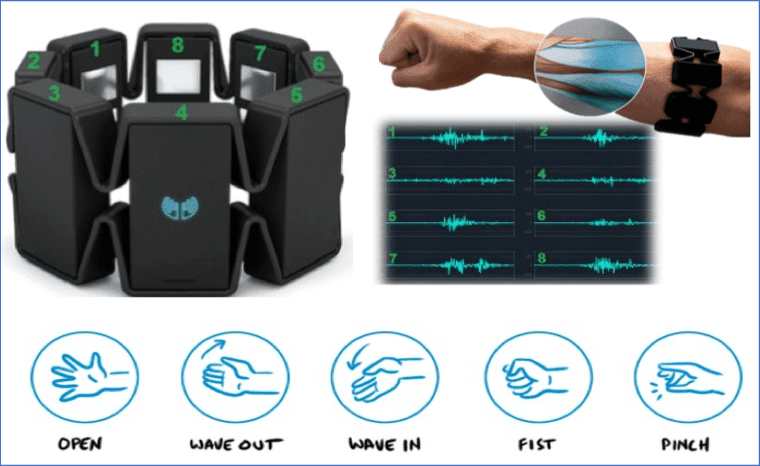

# Contrôle gestuel des robots
2014 &ndash; 2015, [Université de Kyoto](../education/kyoto-u.md)

??? summary "Résumé"

    - Projet de recherche initial à l'Université de Kyoto visant à développer une infrastructure permettant un contrôle ergonomique des robots à l'aide de gestes.
    - Conçu et développé une infrastructure qui abstrait l'interface utilisée en utilisant une API,
      avec une preuve de concept en utilisant le bracelet Myo de Thalmic Labs pour contrôler les robots.

Mon sujet de recherche initial était de développer une infrastructure qui permettrait le contrôle ergonomique des robots à l'aide de gestes.

Mon preuve de concept allait être d'utiliser le bracelet Myo de Thalmic Labs pour contrôler les robots,
soit un bras robotique Kinova, soit l'un des autres robots du laboratoire.
Finalement, mon professeur a déterminé que c'était trop de développement, et pas assez de recherche,
et j'ai changé ma thèse pour [SPIRIT](spirit.md).
Le code source n'est pas disponible publiquement.

J'ai conçu et développé une infrastructure qui permettrait le contrôle gestuel des robots,
tout en abstrayant l'interface utilisée en utilisant une API.
Alors que j'ai testé avec le bracelet, le système a également permis le contrôle en utilisant par exemple, la vision par ordinateur à partir d'une webcam.

La partie la plus difficile a été de trouver de bonnes correspondances intuitives à utiliser.
J'ai examiné l'ergonomie, ainsi que la modification manuelle des configurations,
mais le projet a été annulé avant qu'une version entièrement fonctionnelle puisse être réalisée.

La plupart du code a été écrit en Python, y compris les wrappers pour le [code C++](https://github.com/thalmiclabs) que j'ai écrit pour parler au bracelet et au bras robotique.

{: style="width:400px"}
