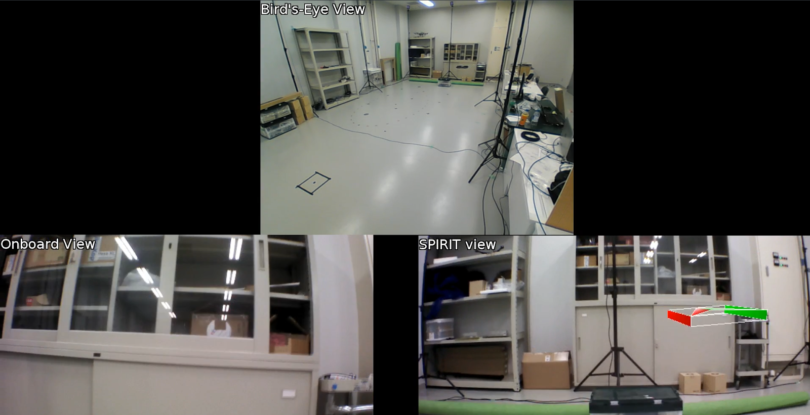

# SPIRIT (Thèse de Master)
2015 &ndash; 2017, [Université de Kyoto](../education/kyoto-u.md).

??? summary "Résumé"

    - Projet de thèse de Master à l'Université de Kyoto, développant une interface de vue à la troisième personne pour contrôler un drone monocular.
    - Créé un système qui superposait une version CGI du drone sur une image réelle prise par la caméra FPV plus tôt.
    - Conçu, réalisé et analysé des études d'utilisateurs qui ont été effectuées pour tester l'efficacité du système,
      qui a montré une grande amélioration dans de nombreux paramètres, même avec un taux de transmission de 2 Hz.

SPIRIT signifie "Subimposed Past Image Records Implemented for Teleoperation".

Le Japon est sujet aux catastrophes naturelles.
L'inspection des structures effondrées ouvre la voie à des opérations de recherche et de sauvetage plus sûres dans l'après-catastrophe.
L'utilisation de drones dans des espaces restreints est difficile,
et les limites du drone ne sont pas visibles dans l'image de la caméra de vue à la première personne (FPV),
surtout avec une caméra monocular.
De plus, la qualité du signal peut être dégradée en raison des matériaux structurels, conduisant à une connexion mauvaise ou instable.

En s'appuyant sur des travaux antérieurs du [laboratoire de mécatronique](http://www.mechatronics.me.kyoto-u.ac.jp/index.php?ml_lang=en)
sur l'utilisation des "Past Image Records" pour la téléopération, les manipulateurs mobiles, et les bandes de communication étroites,
j'ai créé une interface de vue à la troisième personne pour contrôler un AR.Drone, principalement en utilisant Python et ROS.
Une version CGI du drone a été superposée sur une image réelle prise par la caméra FPV plus tôt,
qui contient la position actuelle du drone.

La position du drone était connue grâce aux caméras de capture de mouvement,
mais pourrait également être dérivée d'autres métriques telles que par exemple, l'odométrie visuelle.
Il utilisait une seule caméra comme source, et simulait un environnement de transmission dégradé en laissant tomber des images.
J'ai conçu, réalisé et analysé des études d'utilisateurs qui ont été effectuées pour tester l'efficacité du système.
Il a montré une grande amélioration dans de nombreux paramètres, même avec un taux de transmission de 2 Hz.

Le plus grand défi a été de décider quelles images utiliser.
J'ai créé plusieurs fonctions d'évaluation, et j'ai modularisé le code pour pouvoir sélectionner la fonction à partir des fichiers de lancement.
J'ai également automatisé la génération de nouveaux fichiers de lancement en utilisant la programmation xacro et Python.

!!! abstract "Code source"

    Le code source est disponible sur [GitHub](https://www.github.com/masasin/spirit).
    Il est bien documenté, y compris un [wiki](https://github.com/masasin/spirit/wiki), des listes de contrôle, et des instructions.
    Il contient un noyau ROS ;
    du code de collecte, d'analyse et de visualisation de données ;
    et le code source LaTeX complet pour la thèse.

    Un résumé des composants individuels est [ici](https://github.com/masasin/spirit/wiki/Components),
    et la thèse elle-même peut être téléchargée [ici](https://github.com/masasin/spirit/releases/download/v1.0/mshtsy_thesis.pdf).
