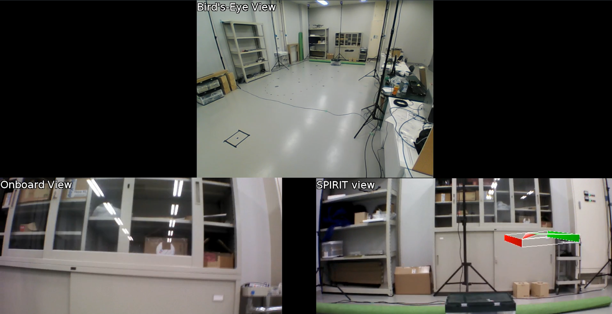

# SPIRIT (Masterthesis)
2015 &ndash; 2017, [Universiteit van Kyoto](../education/kyoto-u.md).

??? summary "Overzicht"

    - Masterthesis project aan de Universiteit van Kyoto, ontwikkeling van een derde-persoons weergave interface voor het besturen van een monoculaire drone.
    - Creëerde een systeem dat een CGI-versie van de drone superponeerde op een eerder door de FPV-camera gemaakt daadwerkelijk beeld.
    - Ontworpen, uitgevoerd, en geanalyseerde gebruikersstudies die werden uitgevoerd om de effectiviteit van het systeem te testen,
      dat een grote verbetering toonde in vele metrieken, zelfs met een transmissiesnelheid van 2 Hz.

SPIRIT staat voor "Subimposed Past Image Records Implemented for Teleoperation".

Japan is gevoelig voor natuurrampen.
Inspectie van ingestorte structuren baant de weg voor veiligere zoek- en reddingsoperaties in de nasleep.
Het gebruik van drones in krappe ruimtes is moeilijk,
en de grenzen van de drone zijn niet zichtbaar in het first-person view (FPV) beeld,
vooral met een monoculaire camera.
Daarnaast kan de signaalkwaliteit worden aangetast door bouwmaterialen, wat leidt tot een slechte of wisselvallige verbinding.

Voortbouwend op eerder werk van het [Mechatronica lab](http://www.mechatronics.me.kyoto-u.ac.jp/index.php?ml_lang=en)
over het gebruik van Past Image Records voor teleoperatie, mobiele manipulatoren, en smalle communicatiebanden,
heb ik een derde-persoons weergave interface gecreëerd voor het besturen van een AR.Drone, voornamelijk gebruikmakend van Python en ROS.
Een CGI-versie van de drone werd superponeerd op een eerder door de FPV-camera gemaakt daadwerkelijk beeld,
dat de huidige positie van de drone bevat.

De positie van de drone was bekend dankzij bewegingsvastleggingscamera's,
maar kon ook worden afgeleid van andere metrieken zoals bijvoorbeeld visuele odometrie.
Het gebruikte een enkele camera als bron, en simuleerde een aangetaste transmissieomgeving door frames te laten vallen.
Ik ontwierp, voerde uit, en analyseerde gebruikersstudies die werden uitgevoerd om de effectiviteit van het systeem te testen.
Het toonde een grote verbetering in vele metrieken, zelfs met een transmissiesnelheid van 2 Hz.

De grootste uitdaging was het beslissen welke beelden te gebruiken.
Ik creëerde meerdere evaluatiefuncties, en moduleerde de code om de functie te kunnen selecteren vanuit de opstartbestanden.
Ik automatiseerde ook het genereren van nieuwe opstartbestanden met behulp van xacro programmeren en Python.

!!! abstract "Broncode"

    De broncode is beschikbaar op [GitHub](https://www.github.com/masasin/spirit).
    Het is goed gedocumenteerd, inclusief een [wiki](https://github.com/masasin/spirit/wiki), checklists, en instructies.
    Het bevat een ROS core;
    data verzameling, analyse, en visualisatie code;
    en de volledige LaTeX broncode voor de thesis.

    Een samenvatting van de individuele componenten is [hier](https://github.com/masasin/spirit/wiki/Components),
    en de thesis zelf kan worden gedownload [hier](https://github.com/masasin/spirit/releases/download/v1.0/mshtsy_thesis.pdf).
