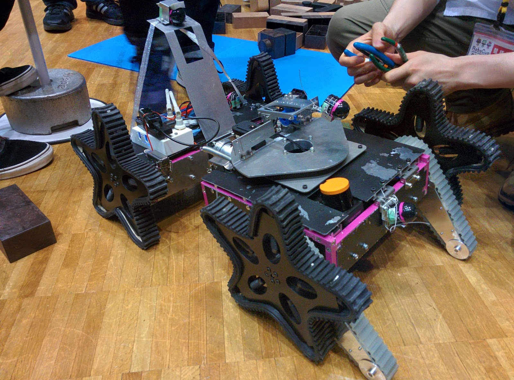
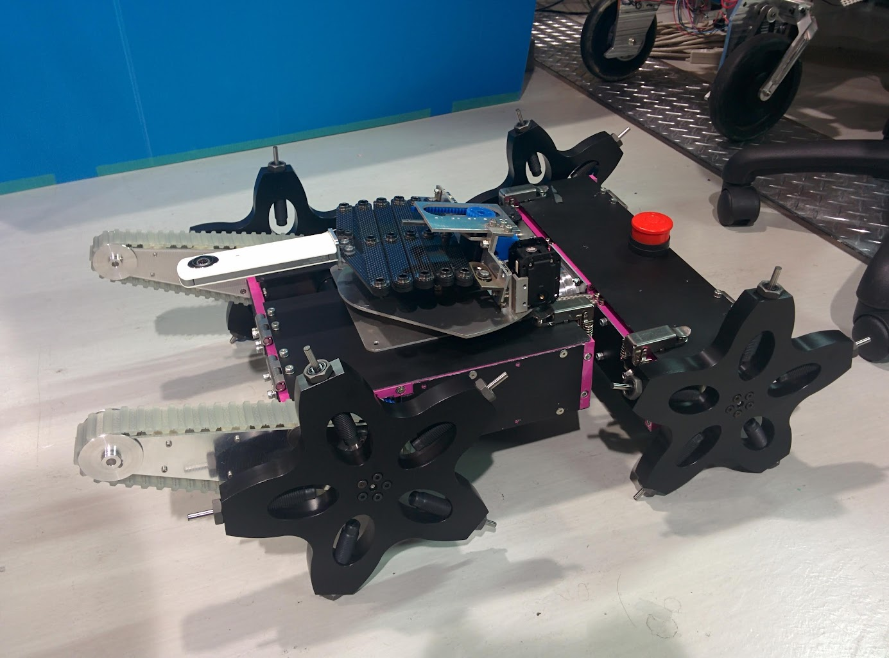

# Yozakura
2014 &ndash; 2015, [Kyoto University](../education/kyoto-u.md)

??? summary

    - Served as software development lead for the Yozakura teleoperated rescue robot at Kyoto University's Mechatronics Lab.
    - Developed a client-server system for robot control and wrote code for onboard Raspberry Pi and mbed chips,
      including drivers for various controllers and sensors.
    - The code was robust against failure and well-documented, providing useful error messages for hardware, software,
      and operator errors of various types, and correcting them where necessary.

{: style="width:400px", align=right}

The Kyoto University [Mechatronics Lab](http://www.mechatronics.me.kyoto-u.ac.jp/index.php?ml_lang=en)’s
[SHINOBI team](https://github.com/kyoto-u-shinobi) designed a new teleoperated rescue robot
called Yozakura to participate in the 2015 [RoboCup Japan Open](http://robocup.or.jp/)
[Rescue League](https://sites.google.com/site/robocupjorescuerobotleague/) in Fukui city.
We also participated in the RoboCup Japan Rescue Camp, a practice competition held in Tsuruga.

Yozakura had star-shaped wheels, flippers, a robotic arm, and various sensors.

I was the software development lead for Yozakura.
I wrote a client-server system to control the robot from the operating station,
as well as drivers for various controllers.
(This was eventually superseded by an rviz interface which used the same controller driver.)

{: style="width:300px", align=left}

I also wrote most of the code for the onboard Raspberry Pi and mbed chips,
as well as I2C drivers for current sensors and a 10-DOF IMU,
drivers for [Dynamixel servos](https://github.com/masasin/dynamixel), Maxon motors, and a Ricoh 360-degree camera.
I also wrote code which allowed the RPi and mbed to communicate serially.

Most of the code was in Python, with some C++ on the mbed.
The code was well-documented and logged.
It was also robust against failure.
It provided useful error messages for hardware, software, and operator errors of various types;
and corrected them where necessary.

!!! abstract "Source code"

    The source code is available on GitHub:

    - [Raspberry Pi](https://github.com/kyoto-u-shinobi/yozakura_raspi)
    - [mbed](https://github.com/kyoto-u-shinobi/yozakura_mbed)
    - [Operator station](https://github.com/kyoto-u-shinobi/yozakura_operator_station)
