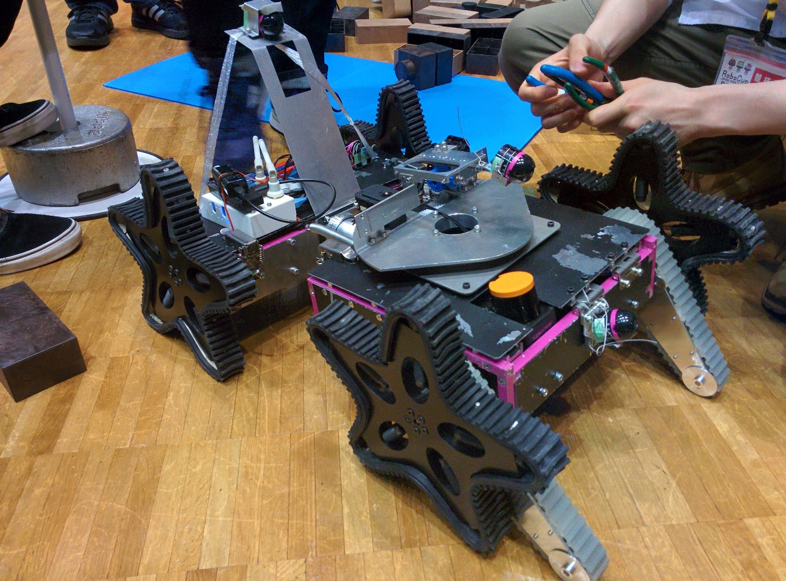

# Yozakura
2014 &ndash; 2015, [Universiteit van Kyoto](../education/kyoto-u.md)

??? summary "Overzicht"

    - Diende als software ontwikkelingsleider voor de Yozakura telebediende reddingsrobot in het Mechatronica Lab van de Universiteit van Kyoto.
    - Ontwikkelde een client-server systeem voor robotbesturing en schreef code voor onboard Raspberry Pi en mbed chips,
      inclusief drivers voor verschillende controllers en sensoren.
    - De code was robuust tegen falen en goed gedocumenteerd, het leverde nuttige foutmeldingen voor hardware-, software-,
      en bedieningsfouten van verschillende soorten, en corrigeerde deze waar nodig.

Het [Mechatronica Lab](http://www.mechatronics.me.kyoto-u.ac.jp/index.php?ml_lang=en) van de Universiteit van Kyoto's 
[SHINOBI team](https://github.com/kyoto-u-shinobi) ontwierp een nieuwe telebediende reddingsrobot 
genaamd Yozakura om deel te nemen aan de 2015 [RoboCup Japan Open](http://robocup.or.jp/)
[Rescue League](https://sites.google.com/site/robocupjorescuerobotleague/) in de stad Fukui.
We namen ook deel aan het RoboCup Japan Rescue Camp, een oefenwedstrijd die gehouden werd in Tsuruga.

Yozakura had stervormige wielen, flippers, een robotarm en verschillende sensoren.

{: style="width:400px"}

Ik was de software ontwikkelingsleider voor Yozakura.
Ik schreef een client-server systeem om de robot te besturen vanaf het bedieningsstation,
evenals drivers voor verschillende controllers.
(Dit werd uiteindelijk vervangen door een rviz interface die dezelfde controller driver gebruikte.)

Ik schreef ook het merendeel van de code voor de onboard Raspberry Pi en mbed chips,
evenals I2C drivers voor stroomsensoren en een 10-DOF IMU,
drivers voor [Dynamixel servo's](https://github.com/masasin/dynamixel), Maxon motoren, en een Ricoh 360-graden camera.
Ik schreef ook code die het mogelijk maakte dat de RPi en mbed serieel konden communiceren.

Het grootste deel van de code was in Python, met wat C++ op de mbed.
De code was goed gedocumenteerd en gelogd.
Het was ook robuust tegen falen.
Het leverde nuttige foutmeldingen voor hardware-, software-, en operatorfouten van verschillende typen;
en corrigeerde deze waar nodig.

!!! abstract "Broncode"

    De broncode is beschikbaar op GitHub:

    - [Raspberry Pi](https://github.com/kyoto-u-shinobi/yozakura_raspi)
    - [mbed](https://github.com/kyoto-u-shinobi/yozakura_mbed)
    - [Bedieningsstation](https://github.com/kyoto-u-shinobi/yozakura_operator_station)
