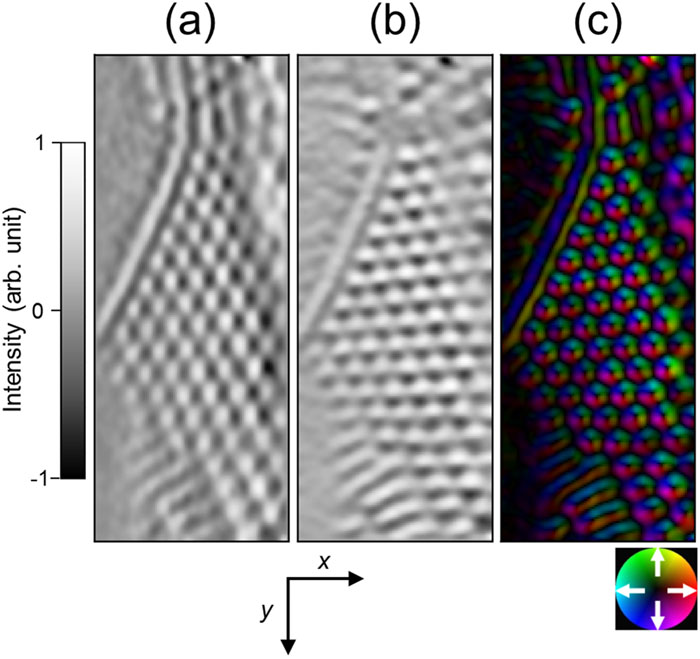

# Teaching experience
2003 &ndash; Present

???+ summary

    - Over 20 years of experience as a private tutor, teaching subjects ranging from math and physics to English and Japanese,
      as well as Python for project work.
    - Notable successes include helping a financial analyst automate his tasks, leading to a promotion and a sponsored masters degree,
      and assisting a PhD student with his research, resulting in a named acknowledgement in his published paper.
    - Since 2019, have been teaching both locally and online.
    - Have a long history of helping colleagues and classmates, tutoring them in various subjects,
      mentoring younger students, and helping them with problems in general.
    - Recognized for the ability to explain complex concepts in simple terms and have received praise
      for patience and effective teaching methods.

## Private tutor
I started tutoring in middle school, when I helped a neighbour pass his national exam.

While living in Japan, I taught English to Japanese students, Japanese to foreign students,
and tutored students up to high school in math and physics in Japanese.

In 2017, after obtaining my Masters degree, I tutored people around Edmonton, Alberta, Canada in Python.
Specifically, I taught skills that helped them in their own projects.

In one case, I started by automating one report of a financial analyst working for a grocery store chain, allowing him to start learning Python on the job.
I also automated one of his side jobs, giving him more disposable income.
He has since automated many more of his tasks, and provided completely new insights to his company.
This has earned him a promotion, a sponsored masters degree, and eventually a new job.
I still provide support as necessary.

In another, I enabled a PhD student to analyze his electron-phase micrographs by writing code which did the same job of a commercial software package with an expensive license.
I was acknowledged by name in [his paper](https://aip.scitation.org/doi/pdf/10.1063/1.5028398?class=pdf).

Since 2019, I have also been teaching Python and Japanese both locally and on [Apprentus](https://www.apprentus.com/in/jn.masasin),
an online lesson platform.

{: style="width:400px"}

## Helping colleagues
At the [University of Waterloo](education/waterloo), I spent many long hours helping my classmates with projects and assignments,
and tutoring them in subjects that they were weak in.
I also became a mentor to younger students.
I participated in orientation week, tutored them with their courses,
and helped navigate the university system, including course selection, the co-op process, getting accommodations, and more.
In addition, I helped many people with personal problems ranging from relationships to academics, from mental health to work and finances.

In 2012 and 2013, I was shadowed by two international exchange students, and helped them integrate into Canada and the university.
I also taught beginner and intermediate Japanese courses as a volunteer with the [University of Waterloo Culture and Language Exchange Club](https://uwclec.webs.com/).

While at [Kyoto University](education/kyoto), I tutored other students in Python and software development best practices,
including testing and version control.

Since graduating, I have helped coworkers at [all of my jobs](work/index),
and have received praise for my patience and ability to explain complex concepts in simple terms.
