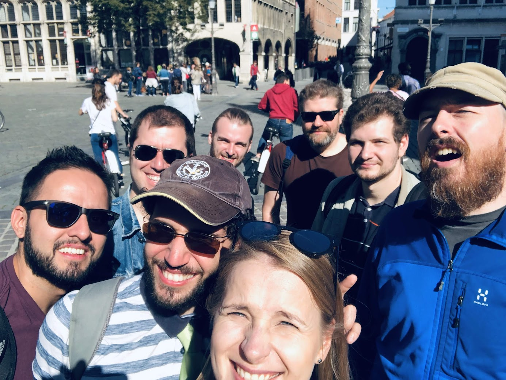

# Data Scientist, [Sentiance](https://www.sentiance.com/)
_February to December 2018, Antwerp, Belgium._

???+ summary

    - Moved the company’s codebase from Python 2 to Python 3.
    - Refactored core functionality into more modular components
    - Verified and built machine learning models in numpy and scikit-learn.
    - Used pyspark to increase code efficiency by parallelizing, or to add new functionality.
    - Created several docker containers and docker-compose files to automate environment setup and teardown.
    - Worked on standardizing DevPI index contents using Pipenv.

{: style="width:300px", align=right}
Sentiance turns IOT sensor data from e.g., mobile phones into insightful data,
such as the segment of the population that a user belongs to, as well as their current actions and predicted future actions.
The core of the codebase was written in Python 2, which reached end of life on January 1, 2020.

My primary role consisted of moving the company’s codebase from Python 2 to Python 3.
I refactored core functionality into more modular components, verified and built machine learning models in numpy and scikit-learn,
and used pyspark to increase code efficiency by parallelizing, or to add new functionality.

Separately, I improved developer productivity by creating several docker containers and docker-compose files
to automate environment setup and teardown. Towards the end, I also worked on standardizing DevPI index contents using Pipenv.
