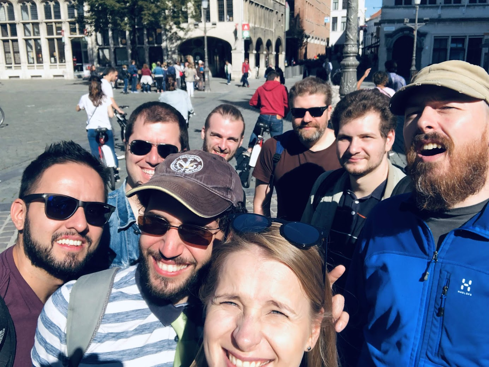

# Work experience
This page contains the details of my work experience after graduation.
For my work experience during my studies, please see the [Co-op page](coop.md).

## Senior Software Engineer, [Adimian](https://www.adimian.com/)
_January 2021 to October 2023, Belgium._

??? summary

    - Took end-to-end project responsibility, including initial design, development, deployment, and maintenance.
    - Developed and maintained a variety of Python applications, including a web-based data management system and a data processing pipeline.
    - Utilized Python libraries like Pydantic, FastAPI, SqlAlchemy, and Redis for backend development and Vue for frontend tasks.
    - Efficiently addressed bug reports and managed releases, maintaining high-standard deliverables.
    - Leveraged tutoring experience to mentor colleagues, helping them improve their skills and on-board new team members, to high praise.

Adimian is a Belgian software consulting firm known for their expertise in custom development, cybersecurity, and big data.
They have a pronounced presence in the energy sector and with European institutions.
Their services are tailored to fit both small and large-scale projects across different environments,
particularly excelling in data engineering and software deployment, underpinned by an unwavering commitment to security and compliance.

{: style="width:400px", align=right}
Working on both internal Adimian products and external projects, I was involved in the complete iterative process,
going from the initial analysis and design, to development and finally deployment and evolutive maintenance.
All Python code was developed using TDD with pytest.

I started with a small project within Adimian, where I had my first exposure to web development using FastAPI and VueJS.
I then developed an SVG schematic generation tool for a photonics company,
and went on to develop another tool which allowed the user to view and navigate said schematics.

I also worked on a governance voting tool used by various energy transmission system operators (TSOs) all over Europe.
The tool had been developed by Adimian using FastAPI, Vue, and VueX,
and I provided critical support by solving bugs and developing new features at the request of the client.

{: style="width:400px", align=left}
I was dispatched to a Regional Coordination Centre for European TSOs in April 2022.
My role entailed end-to-end project responsibility, ranging from initial design to final completion,
followed by proactive and responsive maintenance.

Our workflow consisted of biweekly sprints, where I did code development and documentation, as well as reviewing and testing code written by my coworkers.
The technology stack primarily included Python, where I utilized libraries such as
Pydantic, FastAPI, SqlAlchemy, and Redis for backend development; and Vue for frontend tasks.
In some cases, I designed and implemented ad-hoc scripts, managed releases, and efficiently addressed bug reports,
maintaining the high standard of our deliverables. 

In addition to project work, I also took a mentorship role.
I leveraged my tutoring experience and technical knowledge to help colleagues improve their skills and on-boarded new team members,
guiding their integration into our dynamic working environment.
I also introduced new techniques and methodologies. 

I was highly praised for my patience and understanding when reviewing, explaining, or teaching, as well as the speed and quality of my own code.

## Senior Python Developer, [Yields.io](https://www.yields.io/)
_December 2019 to August 2020, Brussels, Belgium._

??? summary

    - Served as the primary Python developer, working on the core of the platform.
    - Refactored and stabilized the codebase, added tests, fixed bugs, and developed new features.
    - Worked on automatically migrating and testing client code and artifacts with version increases, and deprecated old features.
    - Moved integration tests away from depending on mocks into tests that worked with a deployed Docker environment.

Yields.io is the first company to develop an AI-based automated model risk management system on an enterprise-wide scale
with a platform designed to support the full model life cycle.
They mostly offer their services to the financial sector, with smaller, regional banks automating the model validation effort,
and larger institutions streamlining and scaling their models.

I was the primary Python developer at Yields.
The core of the platform is written in Python, and communicates with a backend API written in Scala.
Jupyter is used by the clients in order to run their algorithms. I refactored and stabilized the codebase, added tests, fixed bugs,
developed new features that the company or clients requested, and added client-facing Jupyter notebooks.

For example, I split what was a monolith into three separate packages which could be deployed independently.
This also allowed clients to implement their own algorithm using our platform as a base in case they wanted to keep them proprietary.

In addition, I used pytest to write thousands of unit tests for previously untested code,
and refactored individual functions to be more testable.
This enabled us to catch new bugs and identify areas where the functionality differed from the design.

I worked on automatically migrating and testing client code and artifacts with version increases, and deprecated old features.
I also helped coworkers when they had questions about parts of the codebase.

Towards the end, I was moving integration tests away from depending on mocks which did not track changes to the API,
into tests that could work with a deployed Docker environment.

## Industrial Automation Engineer, [Kapernikov](https://www.kapernikov.com/)
_March to October 2019, Brussels, Belgium._

??? summary

    - Developed a monitoring system for a conveyor belt using Python 3 and ROS.
    - Used a laser profiler and camera for object identification and created a 3D representation of the conveyor belt.
    - Detected potentially disruptive objects in real time and produced visualizations for the client’s video management system.
    - Fixed bugs in C++ code and created a standalone ROS node for camera communication.

Kapernikov is a consulting company specializing in industrial automation and Industry 4.0.
The client had irregularly shaped objects on a long conveyor belt, some of which blocked the belt and caused long delays.

I developed a monitoring system for the conveyor belt, primarily using Python 3 and ROS.
I used a laser profiler and a camera to identify the highest points in the plane of the laser,
and transformed that into physical coordinates using custom calibration code written in Python.

Knowing the speed of the belt thanks to a connected encoder, I was able to create a 3D representation of the conveyor belt.
This was analyzed, and potentially disruptive objects were detected in real time.
Visualizations were produced and annotated, and then sent to the client’s video management system.

The camera had drivers in C++, as well as in-house C++ code which contained some bugs that I fixed.
I created a standalone ROS node which would talk to the camera and forward only the data needed by the rest of the system.
All other ROS nodes, transformations, and analyses were written in Python.

## Data Scientist, [Sentiance](https://www.sentiance.com/)
_February to December 2018, Antwerp, Belgium._

??? summary

    - Moved the company’s codebase from Python 2 to Python 3.
    - Refactored core functionality into more modular components, verified and built machine learning models in numpy and scikit-learn.
    - Used pyspark to increase code efficiency by parallelizing, or to add new functionality.
    - Created several docker containers and docker-compose files to automate environment setup and teardown.
    - Worked on standardizing DevPI index contents using Pipenv.

{: style="width:300px", align=right}
Sentiance turns IOT sensor data from e.g., mobile phones into insightful data,
such as the segment of the population that a user belongs to, as well as their current actions and predicted future actions.
The core of the codebase was written in Python 2, which reached end of life on January 1, 2020.

My primary role consisted of moving the company’s codebase from Python 2 to Python 3.
I refactored core functionality into more modular components, verified and built machine learning models in numpy and scikit-learn,
and used pyspark to increase code efficiency by parallelizing, or to add new functionality.

Separately, I improved developer productivity by creating several docker containers and docker-compose files
to automate environment setup and teardown. Towards the end, I also worked on standardizing DevPI index contents using Pipenv.
