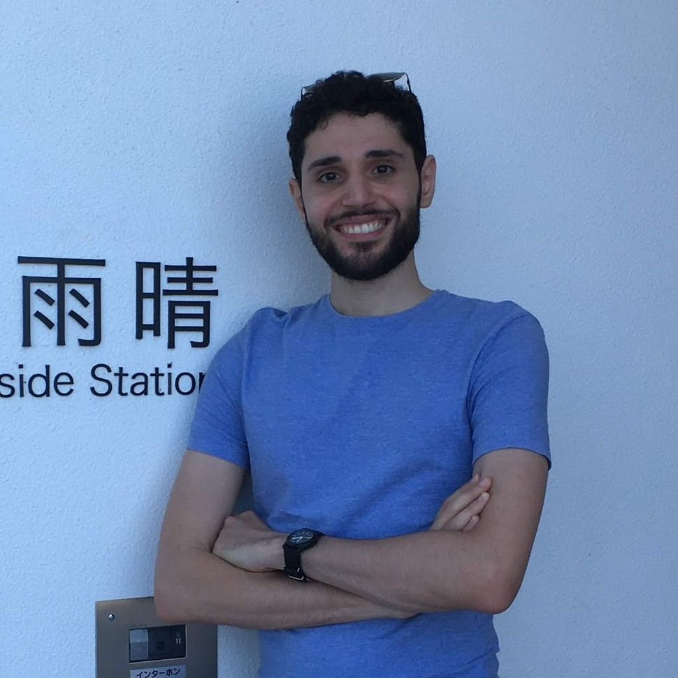

???+ summary
    - Senior software engineer with experience in data science, industrial automation, and web development
    - 10+ years of experience in Python, robotics, and more, with 
    - Looking for [a new full-time opportunity](#hire-me) in Belgium
    - Hold an EU Blue Card; can start on 1 September 2023
    - Email me at [contact@jnassar.com]{{ urls.social.email }}, or [book an appointment]{{ urls.social.cal }}
    - Please see [my CV](cv) for more details

# About me

{: style="width:200px;border-radius: 50%", align="left"}

Hello! I'm Jean Nassar, and I'm a senior Python and robotics expert with more than 10 years of experience that spans continents and disciplines.

I am currently looking for [a new full-time opportunity](#hire-me) in Belgium starting on 1 September 2023.

I have been living in Belgium since 2018, and have worked in multiple fields,
including [data science](cv/work/sentiance), [industrial automation](cv/work/kapernikov), [finance](cv/work/yields), and [web development](cv/work/adimian).
As a senior engineer for almost 4 years, I have [mentored coworkers](cv/mentoring) in Python and software development best practices.

I completed my [Masters program](cv/education/kyoto) with the
[Mechatronics lab]{{ urls.edu.matsuno }} at Kyoto University in Japan.
There, I focused on [human-robot interaction](cv/projects),
with projects such as:

- [Spirit](cv/projects/spirit), a third-person view for monocular drones
- [Yozakura](cv/projects/yozakura), a teleoperated robot for the Rescue League at the RoboCup Japan Open
- [Gestural Control of Robots](cv/projects/myo), infrastructure for controlling robots with gestures and other modalities

I did my [Bachelors of Applied Sciences in Honours Mechatronics Engineering](cv/education/waterloo)
at the University of Waterloo, including [six co-operative education terms](cv/work/coop) at various companies around the world.

I enjoy working on challenging problems that require me to think outside the box, and exploring new frontiers in technology.
This is also reflected in my hobbies, which include
learning new [skills](cv/skills) and [languages](cv/skills.md#languages), automating processes, hiking, and stargazing.

## Hire me
!!! info inline end "EU Blue card requirements"
    - Minimum 1-year contract, full-time only
    - Minimum gross salary differs by region
    - Employer must be in Belgium, or go through a Belgian intermediary

I am currently looking for a new full-time opportunity in Belgium starting on 1 September 2023.

I live in Antwerp.
I strongly prefer remote jobs, and may be able to come to the office occasionally.
I'm also open to other arrangements depending on the type of position.

As a holder of the [EU Blue Card]{{ urls.jobhunt.blue_card }}, I'm equipped to embark on new professional endeavours
immediately upon fulfillment of employment and visa prerequisites.

## Contact
If my experience aligns with your needs, or if you have any questions,
please don't hesitate to email me at [contact@jnassar.com]{{ urls.social.email }}, or [book a call]{{ urls.social.cal }} directly.
I'm always open to new challenges and collaborations.

You can also find me on [GitHub]{{ urls.social.github }} and [LinkedIn]{{ urls.social.linkedin }}.
